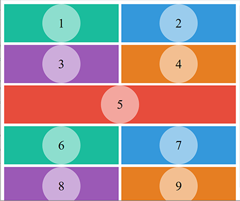
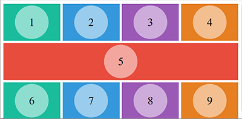
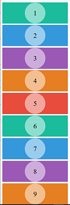
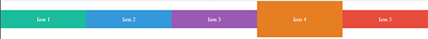
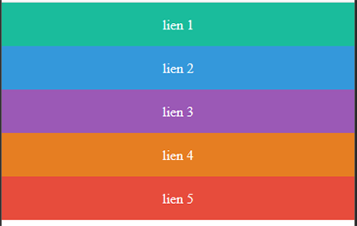
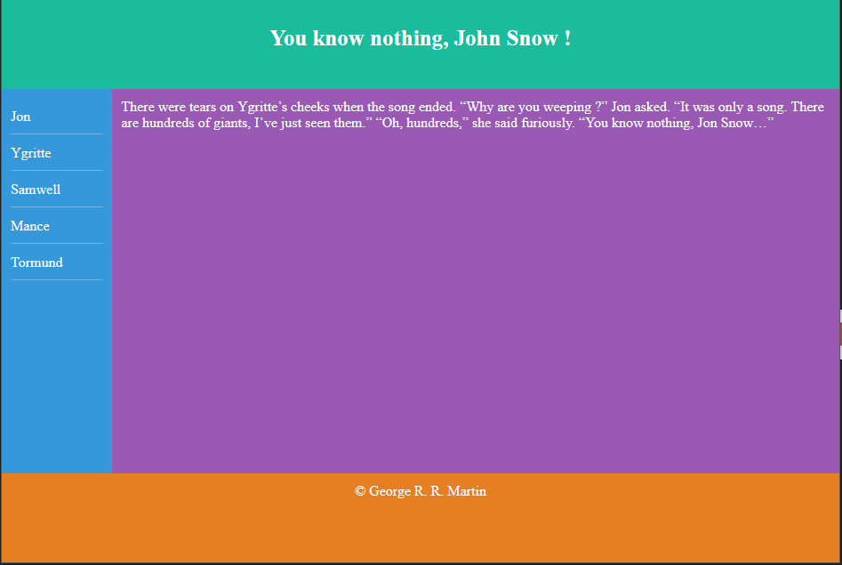
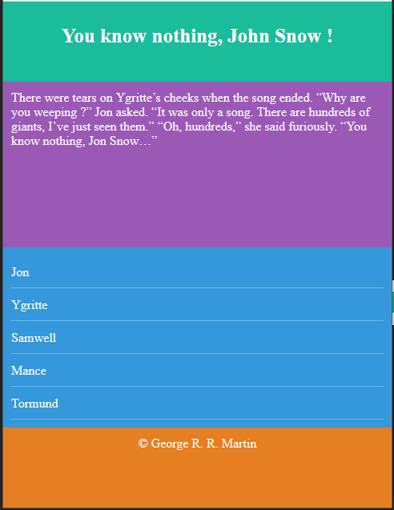
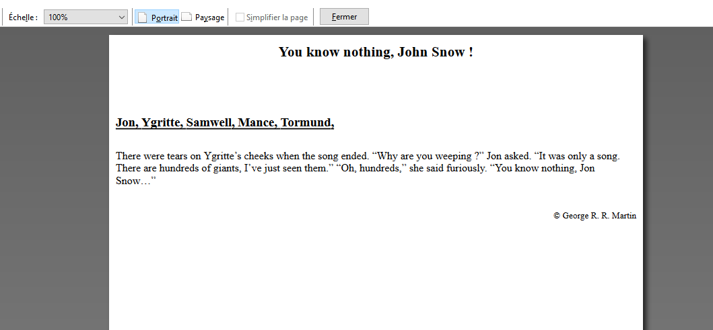

# Exercices MEDIA QUERIES

---

## Exercice 1

Editez les fichiers ex1.html et ex1.css pour obtenir les résultats suivants :
`min-width : 1024px`

`min-width : 600px`

`max-width : 600px`

## Exercice 2

Editez les fichiers ex2.html et ex2.css pour obtenir les résultats suivants.

- Ecran de plus de 640px de large, au survol d'un élément celui-ci est agrandi:

- Ecran de maximum 640px de large:

## Exercice 3

Editez le fichier ex3.css pour obtenir les résultats suivants.

- Ecran de plus de 600px de large, le pied de page est toujours en bas du viewport!

- Ecran de maximum 600px de large

- Version imprimable

### 👉 Article français sur le sujet

<https://www.alsacreations.com/article/lire/930-css3-media-queries.html>
